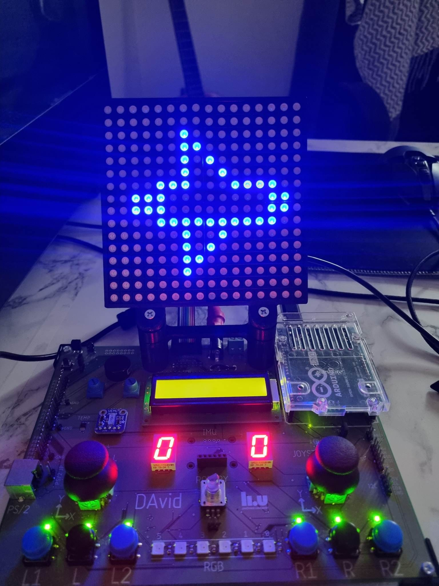
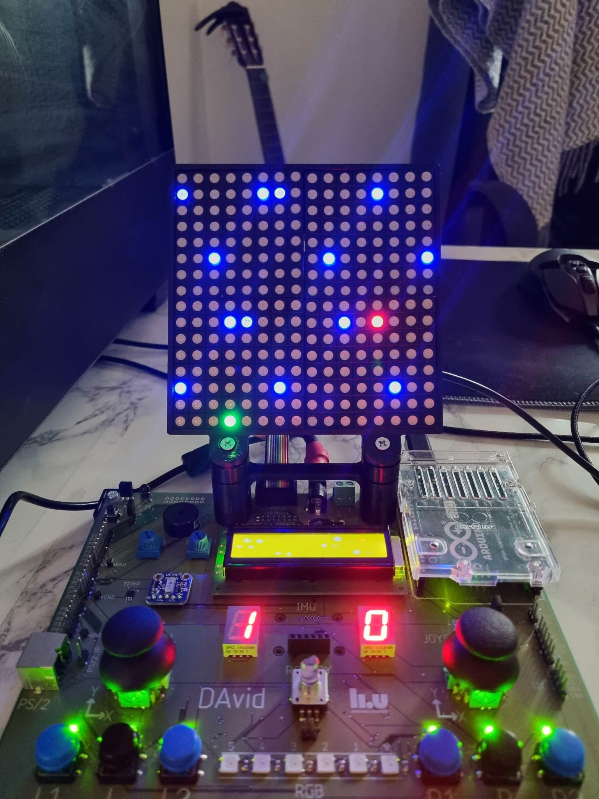

# 🚀 Space Race (Arduino Assembly Project)

A **Space Race–style game** implemented in **Assembly for Arduino (AVR microcontrollers)**.  
This project demonstrates **low-level programming**, direct hardware control, and how classic arcade mechanics can be recreated on microcontrollers.

---

## 🎮 Features

- Written fully in **AVR Assembly**.  
- Runs directly on **Arduino-compatible boards** (e.g., ATmega328P / Arduino Uno).  
- Two-player race mechanics: control rockets to dodge obstacles and reach the finish line.  
- Efficient low-level control of I/O ports and timers.    

---

## 🛠️ Tech Stack

- **Language:** AVR Assembly  
- **Platform:** Arduino (e.g., Arduino Uno / ATmega328P)  
- **Tools:**  
  - [Arduino IDE](https://www.arduino.cc/en/software)

## 📸 Screenshots  

  
  

